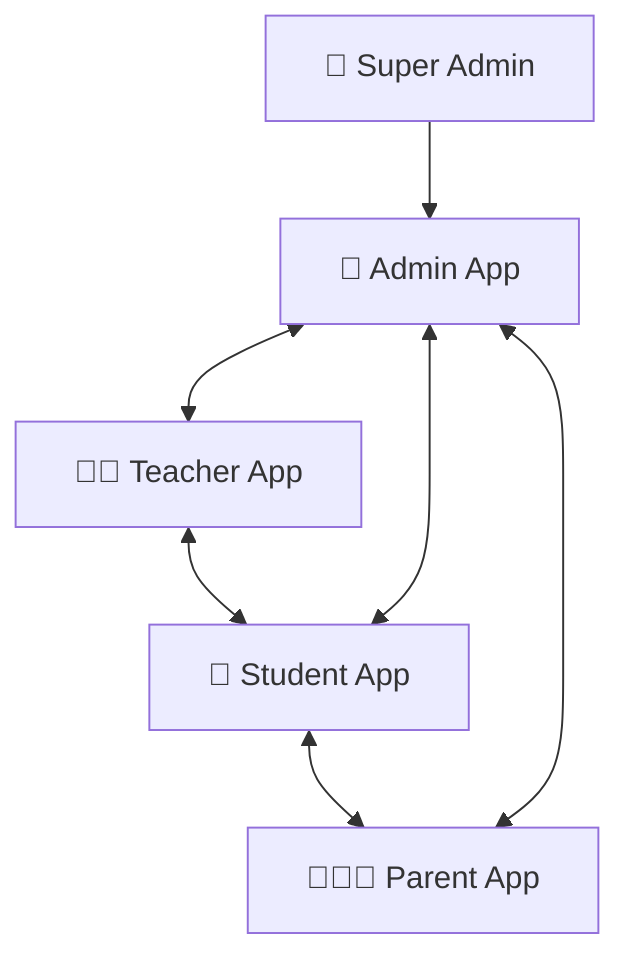

# The EdSentre Book
## النسخة المرجعية الشاملة — Founder Edition
### *بناء البنية التحتية للتعليم الموازي*

---

# فهرس المحتوى

1. المقدمة والرؤية الكبرى  
2. لماذا وُجد EdSentre  
3. المشكلة الحقيقية التي نحلها  
4. ما الذي نبنيه فعلاً  
5. أصحاب المصلحة الأربعة  
6. المنظومة الرباعية المتكاملة  
7. الذكاء الاصطناعي والتميّز التنافسي  
8. فلسفة المنتج والعلامة  
9. القوانين والمبادئ والدستور  
10. نموذج العمل والاقتصاد  
11. التسويق والسرد التجاري  
12. الدليل التقني والمعماري  
13. الأمن والحوكمة والثقة  
14. تجربة صاحب السنتر  
15. خريطة الابتكار والمستقبل  
16. Vision 2045  
17. المصطلحات المرجعية  
18. الخاتمة

---

# 1) المقدمة والرؤية الكبرى

**EdSentre** ليس مجرد برنامج لإدارة السناتر التعليمية، بل **نظام تشغيل تعليمي متكامل** يعيد تصميم العلاقة بين الإدارة، والمعلم، والطالب، وولي الأمر داخل بيئة واحدة متصلة لحظياً.

تاريخياً، أُديرت السناتر عبر الورق، أو جداول Excel، أو أدوات متفرقة لا تتحدث مع بعضها. النتيجة كانت دائماً واحدة:

- فوضى تشغيلية
- تسرب مالي
- بطء في اتخاذ القرار
- ضعف في المتابعة الأكاديمية
- ضغط دائم على الإدارة والمعلمين
- قلق مستمر عند أولياء الأمور

جاء **EdSentre** ليحوّل هذا الواقع من **العشوائية إلى الثقة**، ومن **العمل اليدوي إلى التشغيل الذكي**، ومن **الأنظمة المنفصلة إلى المنظومة الواحدة**.

> نحن لا نبني أداة.
> نحن نبني البنية التحتية الذكية التي يعتمد عليها التعليم الموازي بهدوء وثبات.

---

# 2) لماذا وُجد EdSentre

معظم الشركات تبدأ بفكرة.
القليل يبدأ بفلسفة.
والأقل يبدأ بمبدأ ثابت يمكنه البقاء حتى عندما تتغير التقنيات والأسواق والمنافسون.

EdSentre لم يُخلق لأن العالم يحتاج نظام إدارة آخر.
العالم لديه بالفعل:

- أنظمة حضور
- أنظمة مالية
- بوابات مدرسين
- تطبيقات أولياء أمور
- أدوات امتحانات
- تقارير ولوحات متابعة

لكن هذه كلها لم تكن كافية.

**السبب الحقيقي:** أن التعليم الموازي ما زال **مجزأً**.
كل طرف يعيش واقعاً مختلفاً:

- المالك يحارب التشغيل
- المعلم يحارب التكرار
- ولي الأمر يحارب الغموض
- الطالب يحارب التجربة المشتتة

EdSentre وُجد لكي **يعيد ربط الرحلة التعليمية بالكامل**.
ليس رقمياً فقط.
بل إنسانياً وتشغيلياً وأكاديمياً ومالياً.

---

# 3) المشكلة الحقيقية التي نحلها

المشكلة ليست الورق.
وليست Excel.
وليست البرامج القديمة بحد ذاتها.

هذه كلها **أعراض**.
أما المرض الحقيقي فهو:

## تجزؤ تدفق المعلومات

في السنتر التقليدي، تنتقل المعلومات يدوياً بين:

- المعلم والإدارة
- الإدارة وصاحب السنتر
- السنتر وولي الأمر
- الطالب والمعلم
- الشؤون المالية والحضور

كل انتقال يدوي يخلق:

- تأخيراً
- أخطاءً
- فجوات ثقة
- ضياعاً للوقت
- فرصاً للتلاعب

**EdSentre لا يرقمن الورق فقط.**
بل يعيد تصميم **تدفق المعلومات نفسه** بحيث تصبح المعرفة متاحة لحظياً، والقرارات قابلة للتنفيذ فوراً، والثقة جزءاً أصيلاً من التجربة.

---

# 4) ما الذي نبنيه فعلاً

نحن لا نبني Software فقط.

نحن نبني:

- **ثقة** لصاحب السنتر
- **وقتاً** للمعلم
- **طمأنينة** لولي الأمر
- **تجربة تعلم حديثة** للطالب
- **بنية تشغيلية** يمكن الاعتماد عليها كل يوم

البرنامج هو وسيلة التسليم فقط.
أما المنتج الحقيقي فهو:

- Confidence
- Organization
- Visibility
- Calm
- Trust

نريد أن يصل EdSentre إلى المرحلة التي يصبح فيها وجوده طبيعياً مثل الكهرباء داخل المؤسسة التعليمية.

> الهدف النهائي ليس أن يُقال: "عندنا برنامج".
> بل أن يُقال: **"هذا السنتر يعمل على EdSentre"**.

---

# 5) أصحاب المصلحة الأربعة

كل قرار داخل EdSentre يجب أن يقوي طرفاً واحداً على الأقل من الأطراف التالية:

1. **المالك / المدير**
2. **المعلم**
3. **الطالب**
4. **ولي الأمر**

إذا لم يصبح أيٌّ منهم أقوى بعد الميزة، فلا يجب أن تُبنى.

## 5.1 المالك

المالك يجب أن يقود.
لكن الواقع يجعله يقضي يومه في الأسئلة:

- من حضر؟
- من دفع؟
- من لم يدفع؟
- كم دخل اليوم؟
- كم يستحق كل معلم؟
- هل أستطيع الوثوق في التقرير؟

**EdSentre يعيد القيادة إلى المالك** عبر وضوح لحظي، ورقابة، وربط مالي/تشغيلي صارم.

## 5.2 المعلم

المعلم لم يُخلق لصناعة جداول أو لتكرار المهام الأكاديمية المرهقة.

هو يحتاج إلى نظام:

- يختصر وقت التحضير
- يسرّع صناعة الامتحان
- يبسّط التصحيح
- يدير المجموعات والطلاب بسهولة
- يحمي وقته للشرح الحقيقي

**التقنية هنا لا تستبدل المعلم، بل تحمي قيمته.**

## 5.3 الطالب

الطالب لا يستحق PDFs مبعثرة ورسائل عشوائية وتجربة تقليدية منفصلة.

هو يحتاج إلى تجربة:

- حديثة
- سريعة
- شخصية
- دائمة التوفر
- مشجعة على التعلم لا على الملل

## 5.4 ولي الأمر

ولي الأمر لا يريد مكالمات أكثر.
يريد يقيناً أكبر.

يحتاج أن يعرف — دون أن يسأل:

- هل حضر ابنه؟
- كيف أداؤه؟
- هل عليه مستحقات؟
- هل هناك امتحان أو واجب أو ملاحظة؟

**الحالة المثالية لولي الأمر هي: الثقة الصامتة.**

---

# 6) المنظومة الرباعية المتكاملة

تتكون EdSentre من **4 تطبيقات رئيسية** بالإضافة إلى **لوحة Super Admin** لإدارة المنظومة على المستوى الأعلى.

## 6.1 تطبيق الإدارة — Admin App

**المنصة:** Desktop + Web  
**الدور:** القلب المالي والإداري للمنظومة

### أهم الوظائف

- الربط الفولاذي بين الدفع والحضور
- كشف حساب ذكي لكل طالب
- طباعة فورية للفواتير PDF
- حساب تلقائي لرواتب المعلمين
- سجل تدقيق أمني لكل تعديل أو حذف حساس

### القيمة الحقيقية

- يمنع التسرب المالي
- يسرّع التشغيل اليومي
- يرفع ثقة المالك في الأرقام
- يقلل التلاعب البشري

## 6.2 تطبيق المعلم — Teacher App

**المنصة:** Android + iOS  
**الدور:** المساعد الأكاديمي الرقمي للمعلم

### أهم الوظائف

- توليد امتحانات من PDF بالذكاء الاصطناعي
- رصد وتصحيح سريع للدرجات
- إدارة المجموعات والحضور عبر QR
- نظام تواصل منفصل أكاديمي/أولياء أمور

### القيمة الحقيقية

- اختصار وقت التحضير
- تقليل العمل المتكرر
- تحسين جودة المتابعة الأكاديمية
- تسهيل إدارة الأعداد الكبيرة من الطلاب

## 6.3 تطبيق الطالب — Student App

**المنصة:** Android + iOS  
**الدور:** بيئة تعلم حديثة تفاعلية

### أهم الوظائف

- واجهات غامرة بتصميم Dark حديث
- AI Tutor للمساعدة لا للغش
- نظام امتحانات يحفظ الإجابات محلياً
- Gamification عبر XP وSquads ولوحات الصدارة

### القيمة الحقيقية

- إبقاء الطالب داخل تجربة تعليمية جذابة
- تقليل فقدان الواجبات والإعلانات
- رفع التفاعل والانضباط
- تقديم تعلم ذكي ومتاح دائماً

## 6.4 تطبيق ولي الأمر — Parent App

**المنصة:** Android + iOS  
**الدور:** قناة الثقة والطمأنينة

### أهم الوظائف

- إشعارات لحظية للحضور والانصراف
- متابعة الدرجات والأداء والسلوك
- تقرير مالي فوري للمطلوبات والمدفوعات
- دخول مشروط بالدعوة المرتبطة بالطالب

### القيمة الحقيقية

- تقليل القلق والاستفسارات
- زيادة الثقة في السنتر
- جعل المتابعة مستمرة وشفافة

## 6.5 لوحة Super Admin

**المنصة:** Desktop  
**الدور:** الرقابة والتحكم المركزي

### أهم الوظائف

- تحليلات كلية عبر السناتر
- مراجعة طلبات الانضمام
- تحديد الخطط والكوتا الخاصة بالذكاء الاصطناعي
- تتبع حركات المشرفين أنفسهم

---

# 7) الذكاء الاصطناعي والتميّز التنافسي

يتميز EdSentre بوجود **خدمات ذكاء اصطناعي فعلية داخل المنظومة** وليست مجرد وعود مستقبلية.

| الخدمة | التقنية | الوظيفة | المستفيد |
|---|---|---|---|
| AI Exam Generator | Google Gemini 2.5 Flash | توليد امتحانات اختيارية ومقالية من PDF | المعلم |
| AI Teacher Assistant | Alibaba Qwen + RAG | استخلاص المعرفة وتوليد واجبات من المحتوى | المعلم |
| AI Tutor (Smart Brain) | Alibaba Qwen Plus | دعم الطالب أكاديمياً بالتلميحات والفهم | الطالب |
| Oral Exam | Speech-to-Text + TTS | اختبار شفهي قائم على النطق والاستماع والتقييم | الطالب |
| Career Compass | LLM Engine | اقتراح المسارات والكليات وفق الأداء والاهتمامات | الطالب + ولي الأمر |
| Process Book | RAG + pgvector | فهرسة المحتوى التعليمي وتحويله لبنية معرفة | المنظومة |
| Smart Notification Engine | FCM + Local Trigger | إشعارات ذكية سياقية | الجميع |

## 7.1 فلسفة الذكاء الاصطناعي داخل EdSentre

نحن لا نسأل:

> ماذا يستطيع الذكاء الاصطناعي أن يفعل؟

بل نسأل:

> ما الذي لا ينبغي للبشر أن يضيعوا وقتهم فيه مرة أخرى؟

الذكاء الاصطناعي ليس المنتج.
**المنتج هو الراحة والثقة والكفاءة.**
والذكاء الاصطناعي مجرد محرك لتحقيق ذلك.

## 7.2 ميزة هندسية فارقة: Offline-First

تطبيق الطالب مصمم بحيث يعمل حتى مع انقطاع الإنترنت.

### ماذا يعني ذلك عملياً؟

- الطالب يمكنه حل الامتحان دون اتصال
- المؤقت يستمر محلياً
- الإجابات تُحفظ لحظياً
- المزامنة تتم لاحقاً في الخلفية عند عودة الاتصال

هذه ليست ميزة شكلية.
هذه **موثوقية تشغيلية** مناسبة لواقع المنطقة.

---

# 8) فلسفة المنتج والعلامة

## 8.1 فلسفة المنتج

EdSentre لا يبني Features.
بل يبني **Outcomes**.

كل ميزة يجب أن تحقق واحداً أو أكثر من النتائج التالية:

- توفير الوقت
- تقليل الضغط
- زيادة الثقة
- زيادة الوضوح
- زيادة الإيراد
- تحسين التعلم
- تقوية العلاقة بين الأطراف

إذا لم تحقق الميزة أيّاً من ذلك، فلا يجب أن تُبنى.

## 8.2 فلتر البساطة

قبل إطلاق أي شيء، نمرره على الأسئلة التالية:

- هل يفهمه العميل الجديد فوراً؟
- هل يستطيع المعلم استخدامه دون تدريب معقد؟
- هل يثق به ولي الأمر مباشرة؟
- هل يستطيع المالك شرحه في 30 ثانية؟

إذا كانت أي إجابة: **لا**، فالعمل لم ينضج بعد.

## 8.3 فلسفة التصميم

التصميم ليس زينة.
التصميم هو **وسيلة توصيل المعنى وتقليل الغموض**.

### مبادئ التصميم

- كل شاشة تجيب عن سؤال واحد
- كل زر له غرض
- كل حركة لها معنى
- كل أيقونة تقلل الشك
- المساحات الواسعة تعني ثقة
- الزحام البصري يعني ضعفاً

## 8.4 شخصية العلامة

لو كان EdSentre إنساناً فسيكون:

- هادئاً
- واثقاً
- محترفاً
- ذكياً
- متزناً
- متطلعاً للأمام
- غير صاخب
- غير متعجرف
- غير يائس في بيعه لنفسه

### ما لا تفعله العلامة أبداً

- لا تبالغ
- لا تكذب
- لا تهاجم المنافسين
- لا تصرخ في الإعلانات
- لا تستخدم الخوف كوسيلة بيع

## 8.5 التموضع الشعوري

نحن لا نريد العميل متحمساً فقط.
الحماس يزول.

نحن نريد العميل أن يشعر بـ:

- الأمان
- التحكم
- الوضوح
- الثقة

---

# 9) القوانين والمبادئ والدستور

## 9.1 المبادئ الأساسية

1. حل الواقع، لا الخيال  
2. كل ميزة يجب أن تزيل عملاً، لا أن تصنع عملاً جديداً  
3. الناس أولاً، والتقنية ثانياً  
4. الثقة تُكتسب بالاتساق لا بالدعاية  
5. البرمجيات الجميلة هي البرمجيات الهادئة  
6. كل إصدار يجب أن يجعل المنتج أخف لا أثقل  
7. كل موظف يحمي العلامة  
8. كل تفاعل مع العميل هو Branding  
9. البرمجية العظيمة تشرح نفسها  
10. لا تفاجئ العميل بالتعقيد، بل بالبساطة

## 9.2 القوانين المطلقة

- لا نبني ميزة لأن المنافس يملكها
- لا نضحي بالثقة من أجل الراحة السريعة
- لا نضحي بالجودة من أجل السرعة
- لا نبالغ في الوعد
- لا نجعل العميل يحفظ Workflow معقداً
- كل شاشة تجيب عن سؤال واحد
- كل زر يجب أن يبرر وجوده
- احذف قبل أن تضيف
- كل ميزة يجب أن تخلق قيمة قابلة للقياس
- إذا لم نستطع شرحها في دقيقة، فهي معقدة أكثر من اللازم
- النمو بدون جودة فشل
- لا نطارد الترندات
- المنظومة أهم من أي ميزة منفردة
- الأتمتة لتحرير البشر لا لاستبدالهم
- العلامة تنمو بنجاح العميل لا بميزانية الإعلان

## 9.3 الدستور التشغيلي

### المادة 1
التعليم يستحق بنية تحتية، لا برامج معزولة.

### المادة 2
المنتج موجود لتقليل الفوضى.

### المادة 3
المالك يجب أن يشعر دائماً بالتحكم.

### المادة 4
المعلم يستحق تقنية تعيد له وقته.

### المادة 5
ولي الأمر يستحق شفافية دون أن يطلبها.

### المادة 6
الطالب يستحق رحلة تعليمية ذكية لا متناثرة.

### المادة 7
كل ميزة يجب أن تقوي واحداً من أصحاب المصلحة الأربعة.

### المادة 8
إذا لم يصبح أحد أقوى، تموت الميزة.

### المادة 9
المنظومة أهم من أي تطبيق منفرد.

### المادة 10
السمعة لا تُضحّى بها من أجل السرعة.

---

# 10) نموذج العمل والاقتصاد

## 10.1 فرصة السوق

قطاع الدروس الخصوصية في مصر والمنطقة قطاع ضخم، ويستهلك مليارات الجنيهات سنوياً، مع اعتماد تشغيلي كبير على الإدارة اليدوية والرقابة غير المحكمة.

## 10.2 نموذج الإيراد

**التسعير الحالي المرجعي:**

- **حتى 200 طالب:** 599 جنيهاً مصرياً شهرياً
- **حتى 500 طالب:** 999 جنيهاً مصرياً شهرياً
- **بلا حدود:** 1499 جنيهاً مصرياً شهرياً

## 10.3 فلسفة التكلفة

تم تصميم EdSentre ليعمل بأقل بنية ممكنة مع أعلى كفاءة:

- Gemini ضمن الحدود المجانية المرجعية لعدد كبير من الطلبات اليومية
- Alibaba Qwen منخفض التكلفة جداً على مستوى الرسائل
- Supabase يبدأ مجاناً ثم يرتفع تدريجياً عند التوسع

## 10.4 سيناريوهات النمو

| مرحلة النمو | عدد السناتر | عدد الطلاب | التكلفة الشهرية | الإيراد الشهري | صافي الربح | هامش الربح |
|---|---:|---:|---:|---:|---:|---:|
| البداية | 3 | 500 | ~50 جنيه | 5,000 جنيه | 4,950 جنيه | 99% |
| النمو | 10 | 2,000 | ~1,900 جنيه | 20,000 جنيه | 18,100 جنيه | 90.5% |
| الاستقرار | 25 | 5,000 | ~4,800 جنيه | 50,000 جنيه | 45,200 جنيه | 90.4% |
| التوسع | 100 | 20,000 | ~14,200 جنيه | 200,000 جنيه | 185,800 جنيه | 92.9% |

## 10.5 نقطة التعادل

- في المرحلة المجانية: **5 طلاب فقط** يغطون التكلفة بالكامل
- بعد الترقية المدفوعة: **190 طالباً** يغطون تكاليف السحابة والذكاء الاصطناعي

## 10.6 ماذا يشتري العميل فعلاً؟

العميل لا يشتري Software.
هو يشتري:

- دقة مالية
- راحة تشغيلية
- وضوحاً فورياً
- ثقة لدى ولي الأمر
- صورة مؤسسية أقوى

---

# 11) التسويق والسرد التجاري

نجاح تسويق EdSentre لا يعتمد على استعراض المزايا التقنية فقط، بل على **تحويل الألم اليومي إلى مشهد واضح ثم تقديم الراحة كحل**.

## 11.1 الرسالة التسويقية الأساسية

نحن لا نبيع برنامجاً.
نحن نبيع:

- سيطرة مالية
- متابعة لحظية
- وقتاً للمعلم
- طمأنينة لولي الأمر
- تجربة مستقبلية للطالب

## 11.2 زوايا المحتوى التسويقي

### الزاوية 1: التسرب المالي
"لا حضور بدون دفع"

### الزاوية 2: إرهاق المعلم
"ارفع الـ PDF وخلال دقيقة الامتحان جاهز"

### الزاوية 3: فوضى الحضور
"من الطابور إلى الحضور الذكي"

### الزاوية 4: AI Tutor الحقيقي
"يفهم الطالب ولا يغششه"

### الزاوية 5: الطمأنينة المستقبلية
"من الدرجات إلى توصيات ومسارات"

## 11.3 مبدأ الإعلان

الإعلان لا يجب أن يصرخ.
بل يجب أن:

- يعلّم
- يوضح
- يطمئن
- يعرض الواقع بصدق
- يثبت أن EdSentre يزيل الفوضى فعلاً

---

# 12) الدليل التقني والمعماري

## 12.1 Tech Stack

- **Flutter SDK 3.8.1** لبناء التطبيقات على Android / iOS / Windows / Web
- **Provider** و **flutter_bloc** لإدارة الحالة
- **go_router** للتوجيه والحماية حسب الدور
- **Supabase** للمصادقة والبيانات والتخزين والـ Realtime والـ Edge Functions
- **SQLite + Drift** للتخزين المحلي والمزامنة
- **Shorebird Code Push** للتحديثات الهوائية السريعة

## 12.2 التقسيم البنيوي لقاعدة البيانات

أكثر من **120 جدولاً** موزعة على مجموعات رئيسية:

1. الهوية والصلاحيات  
2. هيكل السنتر والفروع والقاعات والمجموعات  
3. الفواتير والمدفوعات والمصروفات والرواتب  
4. الامتحانات والذكاء الاصطناعي وخطط الدراسة  
5. التفاعل والمجتمع وSquads وFlashcards

## 12.3 بعض الجداول المرجعية المذكورة

- `users`
- `students`
- `teachers`
- `parents`
- `centers`
- `branches`
- `groups`
- `student_group_enrollments`
- `student_invoices`
- `invoice_payments`
- `teacher_salaries`
- `teacher_salary_tiers`
- `exams`
- `ai_exam_analyses`
- `student_weaknesses`
- `study_plans`
- `ai_usage_log`
- `squads`
- `community_posts`
- `flashcards`

## 12.4 الإجراءات البرمجية المخزنة RPCs

أمثلة على المنطق الخلفي المركزي:

- `calculate_teacher_salary_v2`
- `mark_attendance_by_qr`
- `get_student_burnout_risk`
- `get_student_profitability_analysis`

## 12.5 فلسفة البناء التقني

نحن لا نضيف التقنية لأنها مبهرة.
بل لأن المشكلة تحتاجها.

- الذكاء الاصطناعي ليس استراتيجية بذاته
- Offline mode ليس استراتيجية بذاته
- QR ليس استراتيجية بذاته
- Dashboard ليس استراتيجية بذاته

**الاستراتيجية الحقيقية هي: حل مشكلة بشرية بوضوح وبشكل قابل للتوسع.**

---

# 13) الأمن والحوكمة والثقة

الثقة ليست طبقة إضافية.
الثقة هي الميزة الأولى والأخيرة.

## 13.1 عزل البيانات

جميع الجداول الحساسة تعمل تحت **Row Level Security (RLS)** بحيث لا يتجاوز أي مستخدم حدود مركزه.

## 13.2 Audit Log

كل عملية حذف أو تعديل حساسة تُسجل مع:

- هوية المنفذ
- التوقيت
- الحالة القديمة
- الحالة الجديدة

هذا يحول العمليات الحساسة من نقاط خطر إلى مسارات قابلة للمراجعة والمحاسبة.

## 13.3 التخزين الآمن محلياً

رموز الجلسات تُخزن بشكل آمن لتقليل مخاطر الاختراق المحلي.

## 13.4 مبدأ الثقة قبل الابتكار

يمكن للذكاء الاصطناعي أن يبهر.
وللتصميم أن يجذب.
وللأتمتة أن تسرّع.

لكن إن ضعفت الثقة، فلا شيء من ذلك يهم.

---

# 14) تجربة صاحب السنتر

## الكوابيس اليومية التي يحلها EdSentre

### 14.1 طلاب يحضرون دون سداد
**الحل:** الربط بين الدفع والحضور ومنع المرور غير المدفوع.

### 14.2 صناعة الامتحانات وتصحيحها يدوياً
**الحل:** AI Exam Generator + تصحيح فوري + رصد لحظي للدرجات.

### 14.3 شكاوى أولياء الأمور من غياب المتابعة
**الحل:** إشعارات لحظية + درجات + سلوك + حالة مالية.

### 14.4 التلاعب الداخلي أو المجاملات أو ضياع الحقوق
**الحل:** صلاحيات دقيقة + Audit Log + مركزية للبيانات.

## النتيجة النهائية لصاحب السنتر

عندما يفتح صاحب السنتر EdSentre في آخر اليوم، يجب أن يرى بسرعة:

- حضور اليوم
- إيراد اليوم
- أداء المعلمين
- المتأخرات
- الامتحانات القادمة

ثم يغلق التطبيق خلال أقل من دقيقة.
لا لأن المعلومات ناقصة.
بل لأنها **واضحة ومركزة وكافية**.

---

# 15) خريطة الابتكار والمستقبل

المنظومة مصممة لتستوعب تطويرات مستقبلية توسّع الفارق التنافسي:

1. **Ghost Attendance** عبر BLE بدلاً من QR  
2. **AI Essay Grader** لتصحيح الإجابات المقالية  
3. **Tinder-Style Grading** لتسريع التصحيح اليدوي  
4. **Live Hall Pulse** لقياس استيعاب الطلاب لحظياً داخل القاعة  
5. **EdSentre Coins** لربط التحفيز بمكافآت وشراكات حقيقية

## مبدأ الابتكار

الابتكار ليس إضافة Technology.
الابتكار هو **إزالة ألم كان موجوداً بالأمس ولم يعد موجوداً اليوم**.

---

# 16) Vision 2045

نحن لا نتنبأ بالمستقبل.
نحن نصممه.

## صورة 2045 كما تراها EdSentre

- ولي الأمر لا يسأل: هل حضر ابني؟
- الدفع كله واضح وشفاف
- المعلم لا يقضي ليله في إعداد الامتحانات
- التقارير تظهر تلقائياً
- السناتر لا تتنافس في الإدارة، بل في جودة التعليم

## الرؤية الأبعد

مع الزمن يمكن أن يصبح EdSentre:

- نظام التشغيل للتعليم الموازي
- طبقة البنية التحتية الخلفية التي يعتمد عليها الجميع
- منظومة تربط السناتر والمعلمين والطلاب والأسر والمعرفة في شبكة تعليمية واحدة

## الرمز المستقبلي

نريد لعبارة:

**Powered by EdSentre**

أن تصبح رمزاً يفهمه السوق فوراً، ويعني:

- احترافية
- تنظيم
- موثوقية
- جودة
- ثقة

---

# 17) المصطلحات المرجعية

## Chaos
أي عمل يدوي متكرر لا يجب أن يكون موجوداً.

## Confidence
الحالة النفسية التي يجب أن يشعر بها العميل بعد فتح EdSentre.

## Invisible Technology
تقنية تؤدي عملها دون أن تطلب الانتباه لنفسها.

## Infrastructure
شيء يعتمد عليه الناس يومياً دون أن يفكروا فيه.

## Stakeholders
المالك، المعلم، الطالب، ولي الأمر.

## Calm
الإحساس الذي يجب أن تصنعه كل شاشة داخل المنظومة.

## Operating System
ليس مجرد برنامج، بل بيئة كاملة تربط العملية التعليمية.

## Trust
أغلى أصل داخل EdSentre. صعب الاكتساب، سهل الفقدان.

## Simplicity
نتيجة تفكير عميق، لا غياب القوة.

## Product
آلة تحوّل الفوضى إلى ثقة.

---

# 18) الخاتمة

EdSentre بدأ كفكرة.
ثم صار فلسفة.
ثم تحول إلى منتج.
ثم إلى رؤية لمنظومة أكبر.

لسنا نبني برنامجاً لإدارة السناتر فقط.
نحن نبني **معياراً جديداً** لكيفية إدارة التعليم الموازي.

قد ينسخ الآخرون الواجهات.
وقد ينسخون المزايا.
وقد ينسخون التسعير.

لكن ما لا يمكن نسخه بسهولة هو:

- الفلسفة
- الانضباط
- وضوح المبدأ
- جودة القرارات
- الثقة المتراكمة

> مهمتنا ليست أن نصنع ضجيجاً.
> مهمتنا أن نعيد تنظيم التعليم الموازي بهدوء، وذكاء، وثبات.

> وإذا جاء يوم سأل فيه أحدهم:
> "متى أصبح التعليم الموازي أكثر تنظيماً؟"
>
> نريد أن تكون الإجابة:
> **حدث ذلك تدريجياً... لأن EdSentre كان موجوداً.**
