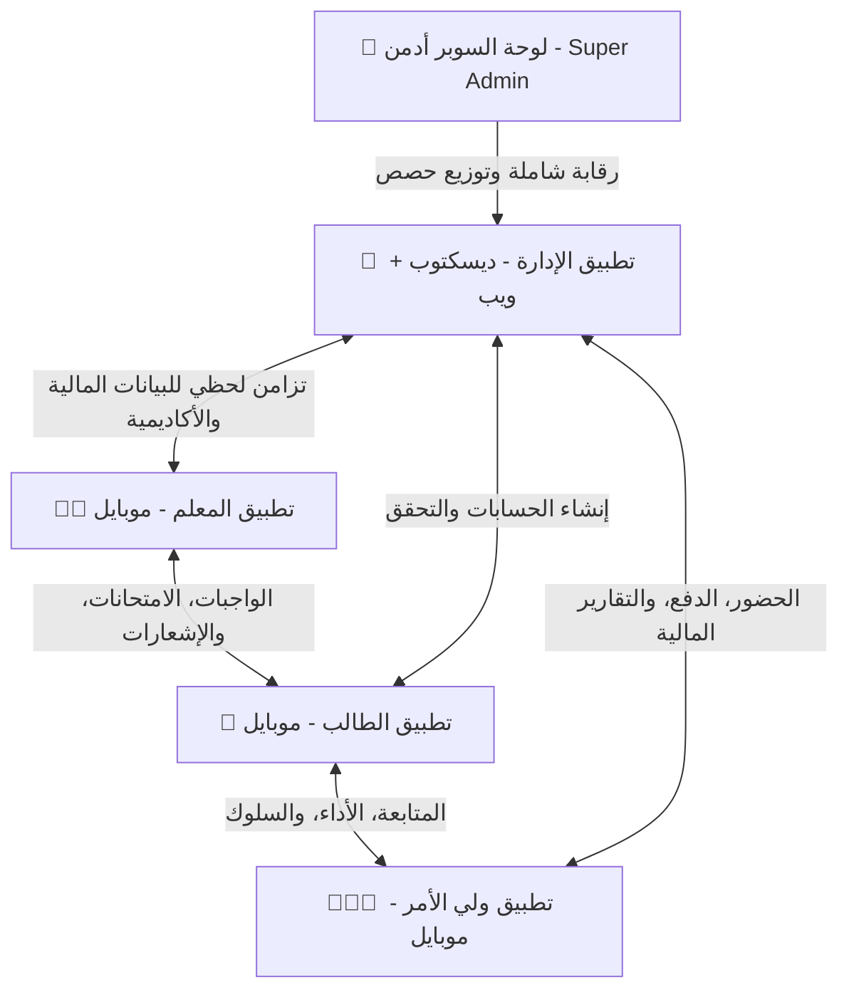

# 📖 الدليل المرجعي الشامل لمنظومة EdSentre (Master Reference)
## السيطرة المطلقة.. لمستقبل تعليمي أذكى
### *المرجع الأساسي والكامل للمنظومة (رؤية، تقنية، علامة تجارية، تشغيل، وتسويق)*

---

## 🎯 1. المقدمة والرؤية الكبرى (Vision & Philosophy)

منظومة **EdSentre** ليست مجرد تطبيق أو أداة لإدارة المراكز التعليمية (السناتر)، بل هي **نظام تشغيل تعليمي متكامل (Ecosystem)** صُمم ليعيد هيكلة العلاقة بين الأطراف الأربعة (المدير، المعلم، الطالب، ولي الأمر) في بيئة موحدة متصلة لحظياً. 

تاريخياً، عانى التعليم الموازي من الفوضى: تسرب مالي، أخطاء يدوية، انفصال بين الطالب والمعلم خارج القاعة، وانعدام شفافية مع أولياء الأمور. جاءت EdSentre لتحول هذه العشوائية إلى **ثقة ويقين**، وتوفر بنية تحتية تشغيلية وهادئة يعتمد عليها النظام التعليمي.

**الفلسفة الأساسية:** نحن لا نبني "ميزات" (Features)، نحن نبني "نتائج" (Outcomes). كل زر وكل شاشة يجب أن توفر وقت المعلم، وتزيد تحكم المدير، وتجذب اهتمام الطالب، وتطمئن ولي الأمر. 

---

## 🏢 2. المنظومة المتكاملة والتطبيقات (The 4-App Ecosystem)

تتكون المنظومة من 4 تطبيقات رئيسية تعمل بتزامن كامل، بالإضافة إلى لوحة التحكم العليا (Super Admin).

### 🏢 2.1 تطبيق الإدارة (Admin App)
* **المنصة:** Desktop (Windows) + Web
* **الهدف:** القلب المالي والإداري للمنظومة (ERP مصغر).
* **التفاصيل والميزات:**
  * **الربط الفولاذي بين الدفع والحضور:** النظام يمنع تسجيل حضور أي طالب لم يسدد اشتراكه، مع تنبيه لحظي لموظف الاستقبال (السكرتارية).
  * **كشف حساب الطالب الذكي:** تتبع دقيق لكل معاملة مالية (دفع، متأخرات، خصومات، غرامات).
  * **الطباعة الفورية:** توليد وطباعة فواتير PDF احترافية أو إيصالات حرارية لحظياً.
  * **محرك الرواتب الآلي:** حساب فوري ودقيق لرواتب المعلمين بناءً على شرائح (Tiers) ونسب متفق عليها سلفاً (يتم معالجتها في قواعد البيانات عبر RPC).
  * **سجل التدقيق الأمني (Audit Log):** كل حركة (تعديل درجة، مسح فاتورة، تغيير حضور) تُسجل باسم الموظف وتوقيتها والتغيير الذي حدث لمنع التلاعب.

### 👨‍🏫 2.2 تطبيق المعلم (Teacher App)
* **المنصة:** Mobile (Android + iOS)
* **الهدف:** المساعد الأكاديمي الرقمي الذي يوفر 90% من وقت المدرس.
* **التفاصيل والميزات:**
  * **توليد الامتحانات بالـ AI:** رفع أي مذكرة PDF، ويقوم النظام بتوليد امتحان (اختياري/مقالي) جاهز في ثوانٍ.
  * **الرصد والتصحيح الآلي:** بمجرد تسليم الطلاب إجاباتهم عبر تطبيقهم، يتم تصحيح مئات الامتحانات في ثانية ورصد الدرجات في السجلات.
  * **إدارة المجموعات بالـ QR:** نقل الطلاب بين المجموعات وتسجيل الحضور سريعاً باستخدام الكاميرا.
  * **التواصل المزدوج:** قنوات تواصل أكاديمية منفصلة للطلاب، وقنوات إدارية لأولياء الأمور لتجنب الفوضى.

### 📱 2.3 تطبيق الطالب (Student App)
* **المنصة:** Mobile (Android + iOS)
* **الهدف:** بيئة تعليمية تفاعلية حديثة تجذب الطالب وتحببه في التعلم.
* **التفاصيل والميزات:**
  * **تجربة بصرية غامرة:** تصميم يعتمد على الوضع الليلي (Dark Mode) مع تأثيرات زجاجية وحركات ناعمة.
  * **الامتحانات محلياً (Offline-First):** نظام عبقري يسمح للطالب بحل الامتحان حتى لو انقطع الإنترنت. يُحفظ الحل محلياً ويستمر المؤقت لمنع الغش، ثم تتم المزامنة صمتاً عند عودة الاتصال.
  * **AI Tutor (Smart Brain):** شات ذكي يعتمد على RAG، لا يحل للطالب الواجب مباشرة ليغش، بل يقدم له تلميحات وشرحاً لطريقة التفكير (Socratic Method).
  * **التلعيب (Gamification):** نظام نقاط (XP)، بطولات دورية، الانضمام لفرق (Squads)، ولوحات المتصدرين (Leaderboards).

### 👨‍👩‍👦 2.4 تطبيق ولي الأمر (Parent App)
* **المنصة:** Mobile (Android + iOS) - مدمج مع تطبيق المعلم (Dual-Role).
* **الهدف:** صمام الأمان وباني الطمأنينة للأهل.
* **التفاصيل والميزات:**
  * **الإشعارات اللحظية:** إشعار فوري بدخول الابن السنتر وخروجه منه.
  * **الشفافية الأكاديمية والمالية:** وصول فوري لدرجات الابن، الواجبات المتأخرة، تقييم السلوك، والفواتير المستحقة.
  * **الوصول الآمن:** لا يمكن التسجيل إلا برمز دعوة (Invite Code) صادر من السنتر لضمان الخصوصية القصوى.

### 👑 2.5 لوحة التحكم العليا (Super Admin)
* **المنصة:** Desktop
* **الهدف:** مراقبة النظام بأكمله والتحكم بالمراكز المشتركة.
* **التفاصيل والميزات:**
  * تحليلات مالية وأكاديمية كلية لجميع السناتر.
  * تحديد حصص الذكاء الاصطناعي (AI Quotas) لكل سنتر.
  * مراقبة أمنية لحركات مديري النظام أنفسهم.

---

## 🎨 3. الهوية البصرية والعلامة التجارية (Brand Identity & UI/UX)

تم تصميم الهوية البصرية لتعكس "الهدوء، الاحترافية، الذكاء، والثقة". يجب الالتزام الصارم بالمتغيرات التالية في جميع واجهات المنظومة لضمان الاتساق:

### 3.1 منظومة الألوان (Color Palette)
الألوان الأساسية مبنية لتدعم تصميم الـ Dark Mode الفاخر:
* **الألوان الأساسية (Primary):**
  * الكحلي العميق `Navy`: `#050E1F` (لون الخلفية الأساسي).
  * الكحلي المتوسط `Navy Mid`: `#0B1A35` (للبطاقات والمكونات البارزة).
  * الكحلي الفاتح `Navy Light`: `#112244` (للتأثيرات والحواف).
  * التركواز `Teal`: `#00C8D7` (اللون التمييزي الرئيسي والماركة الأساسية).
  * التركواز الغامق `Teal Deep`: `#00A3B5` (عند الضغط أو التظليل).
  * الأزرق الكهربائي `Electric`: `#3B7BFF` (للتدرجات والأزرار الثانوية).
  * توهج الأزرق `Electric Glow`: `#5B9BFF`.

* **الألوان المحايدة (Neutrals):**
  * الأبيض `White`: `#FFFFFF` (للنصوص الأساسية).
  * الأبيض الناعم `White Soft`: `#F4F7FF` (للخلفيات الفاتحة جداً).
  * درجات الرمادي: 
    * `Gray 100`: `#E8EDF8`
    * `Gray 300`: `#A8B5CC` (للنصوص الثانوية).
    * `Gray 500`: `#6B7DA0` (للنصوص الإرشادية والأيقونات غير النشطة).
    * `Gray 700`: `#3A4A6B` (للفواصل والحدود).

* **ألوان الحالة (Semantic / State Colors):**
  * النجاح/الإيجابي `Success`: `#00D68F`.
  * التحذير/المعلق `Warning`: `#FFB800`.
  * الخطر/المتأخرات `Danger`: `#FF4757`.
  * التميز/الذهب `Gold`: `#F5C542` (للنجوم ومستويات الـ Gamification).

### 3.2 الخطوط (Typography)
نظام الخطوط يجمع بين الأصالة العربية والحداثة التقنية:
* **العربية (Primary Arabic):** `Cairo` (أوزان: 300, 400, 500, 600, 700, 800, 900) - يُستخدم لكل النصوص والمحتوى العربي.
* **الإنجليزية (Primary English):** `Space Grotesk` - يُستخدم للعناوين الإنجليزية، اللوجو، والشعارات.
* **الأكواد والأرقام (Monospace):** `JetBrains Mono` - يُستخدم لكتابة الأكواد، الأرقام المالية، والبيانات الدقيقة لتسهيل القراءة.

### 3.3 المكونات البصرية (Visual Components)
* **التدرجات (Gradients):** يتم دمج الـ Teal مع הـ Electric Blue لإنتاج تدرجات توحي بالذكاء الاصطناعي والمستقبل (مثل تأثير `adGlow`).
* **الزوايا (Border Radius):** 
  * `12px` و `16px` للبطاقات (Cards).
  * `100px` (Pill-shape) للأزرار الأساسية وحالة الـ Badges.
* **الظلال (Shadows):** الاعتماد على ظلال ناعمة (Soft Glow) بالألوان `Teal` أو ظلال داكنة جداً للتباين مع الخلفية الكحلية، والابتعاد عن الظلال الرمادية القوية.

---

## 🤖 4. الذكاء الاصطناعي الفعلي (AI & Unique Selling Points)

تتفوق المنظومة بوجود خدمات AI حقيقية قيد التشغيل المدمج:

1. **AI Exam Generator (المعلم):** توليد امتحانات دقيقة (Google Gemini 2.5 Flash) من ملفات الـ PDF.
2. **AI Teacher Assistant (المعلم):** استخلاص المعرفة وتوليد الأسئلة والواجبات باستخدام (Alibaba Qwen + RAG).
3. **AI Tutor / Smart Brain (الطالب):** شات ذكي وموجّه مبني على منهج السنتر فقط (Alibaba Qwen Plus) يمنح تلميحات أكاديمية دقيقة.
4. **الامتحان الشفهي (الطالب):** نظام تفاعلي (Speech-to-Text + TTS) ينطق السؤال بالصوت ويستقبل إجابة الطالب الصوتية ويقيمها.
5. **البوصلة المهنية - Career Compass (الطالب/الولي):** محرك LLM يحلل مستويات الطالب على مدار العام ويقترح الكليات والمسارات المهنية المناسبة باحتمالات دقيقة.
6. **Process Book (النظام):** محرك فهرسة خلفي بتقنية RAG و pgvector لفهم محتوى الملازم وتحويلها لبيانات قابلة للبحث الذكي.
7. **محرك الإشعارات الذكي:** توليد رسائل تحفيزية للطلاب وطمأنة لأولياء الأمور في التوقيت المناسب عبر FCM.

---

## ⚙️ 5. الدليل التقني والمعماري (Technical Architecture)

### 5.1 مكدس التقنيات (Tech Stack)
* **Frontend:** Flutter SDK 3.8.1 لضمان الكود الموحد لكل المنصات.
* **State Management:** `flutter_bloc` بشكل رئيسي للميزات الجديدة، و `Provider` للميزات الموروثة.
* **Routing:** `go_router` مع نظام حماية للمسارات (Auth Guards).
* **Backend:** Supabase (Authentication, PostgreSQL, Storage, Realtime, Edge Functions).
* **Local Storage & Sync:** SQLite عبر مكتبة `Drift` لتحقيق المعمارية غير المتصلة (Offline-First).
* **التحديثات الهوائية:** Shorebird Code Push لتجاوز بطء المتاجر.

### 5.2 قاعدة البيانات وهيكلتها
قاعدة بيانات ضخمة (أكثر من 120 جدولاً) مقسمة وظيفياً:
* **الهوية والصلاحيات:** `users`, `students`, `teachers`, `parents`, `app_roles`
* **بنية المركز:** `centers`, `branches`, `groups`, `student_group_enrollments`
* **الماليات والرواتب:** `student_invoices`, `invoice_payments`, `expenses`, `teacher_salaries`
* **الامتحانات والمذاكرة:** `exams`, `exam_drafts_table`, `ai_exam_analyses`, `study_plans`
* **التفاعل:** `squads`, `community_posts`, `flashcards`

### 5.3 الإجراءات المخزنة (RPCs - Stored Procedures)
يتم تفريغ العمليات الحسابية المعقدة لقاعدة البيانات لضمان الأمان والسرعة:
* `calculate_teacher_salary_v2`: نظام دقيق لحساب المرتبات.
* `mark_attendance_by_qr`: ربط فوري للـ QR بالحالة المالية.
* `get_student_burnout_risk`: مؤشر رياضي لاحتمالية احتراق أو تسرب الطالب.
* `get_student_profitability_analysis`: تحليل تكلفة وربحية كل طالب.

---

## 🔒 6. الأمن، الحوكمة، والثقة (Security & Governance)

الثقة هي أساس المنظومة، وتُحقق عبر:
1. **عزل البيانات الصارم (RLS - Row Level Security):** دالة `get_user_center_id()` تمنع أي شخص أو استعلام من رؤية بيانات مركز تعليمي آخر نهائياً.
2. **سجل التدقيق (Audit Trigger):** مشغل (Trigger) على قاعدة البيانات يُسجل فوراً أي تعديل مالي أو أكاديمي في `audit_log` ولا يمكن لأي موظف مسحه.
3. **التشفير المحلي:** يتم حفظ الجلسات في `flutter_secure_storage`.
4. **التزامن غير المتصل:** في حالة غياب الإنترنت، البيانات الحساسة (كالإجابات) تحفظ محلياً وتزامن بطريقة آمنة لاحقاً دون ضياع مجهود.

---

## 💰 7. نموذج العمل والاقتصاد (Business Model)

* **التسعير الأساسي:**
  * حتى 200 طالب: 599 جنيه شهرياً.
  * حتى 500 طالب: 999 جنيه شهرياً.
  * باقة بلا حدود: 1499 جنيه شهرياً.
* **كفاءة التكلفة:** الاعتماد على نماذج AI رخيصة وكفؤة (Gemini Flash المجاني، Qwen المنخفض التكلفة جداً)، مما يرفع هامش الربح التشغيلي إلى ما يتجاوز **90%**.
* **نقطة التعادل:** 5 طلاب يغطون المرحلة الأولى، و 190 طالباً يغطون الخوادم المدفوعة (Pro).
* **القيمة المبيعة الحقيقية:** أصحاب السناتر لا يشترون برنامجاً؛ بل يشترون (الدقة، السيطرة، الطمأنينة، والمظهر المؤسسي).

---

## 🚀 8. خارطة الابتكار المستقبلية (Vision & Roadmap)

1. **الحضور الشبحي (Ghost Attendance):** الحضور عبر تقنية BLE بمجرد مرور الطالب في القاعة (بدون طوابير QR).
2. **AI Essay Grader:** قراءة إجابات الطلاب بخط اليد وتصحيحها ذكياً.
3. **Tinder-Style Grading:** واجهة للمساعدين لتصحيح الدفاتر سريعاً (سحب يمين/يسار).
4. **Live Hall Pulse:** استطلاع فوري وسريع للطلاب في القاعة لقياس الفهم الحي.
5. **اقتصاد الكوينز المفتوح:** تحويل نقاط الطلاب إلى خصومات حقيقية في الكافيتريا أو المكتبات.

---

## 📜 9. الدستور التشغيلي والقوانين المطلقة (The Constitution)

1. **الناس أولاً، والتقنية ثانياً:** التكنولوجيا موجودة لخدمة المعلم والطالب، وليس العكس.
2. **البرمجيات الجميلة هي البرمجيات الهادئة:** لا للتعقيد البصري ولا للإزعاج. كل شاشة تجيب عن سؤال واحد فقط.
3. **المنظومة أهم من الميزة:** أي ميزة تُضاف يجب أن تقوي أحد أطراف المنظومة وتتوافق مع البقية دون كسر التوازن.
4. **الثقة تُكتسب بالاتساق:** الصرامة في تسجيل التدقيقات، وعدم فقدان البيانات (Offline-First)، والالتزام بالأمان المطلق للماليات والدرجات.
5. **Powered by EdSentre:** أن يصبح هذا الشعار دليلاً على الاحترافية والشفافية لكل سنتر يمتلكه. 

> [!IMPORTANT]
> **يجب العودة لهذا المرجع الشامل قبل اتخاذ أي قرار برمجي، تسويقي، أو تصميمي في منظومة EdSentre. إنه المعيار الذهبي لكل ما نبنيه.**
